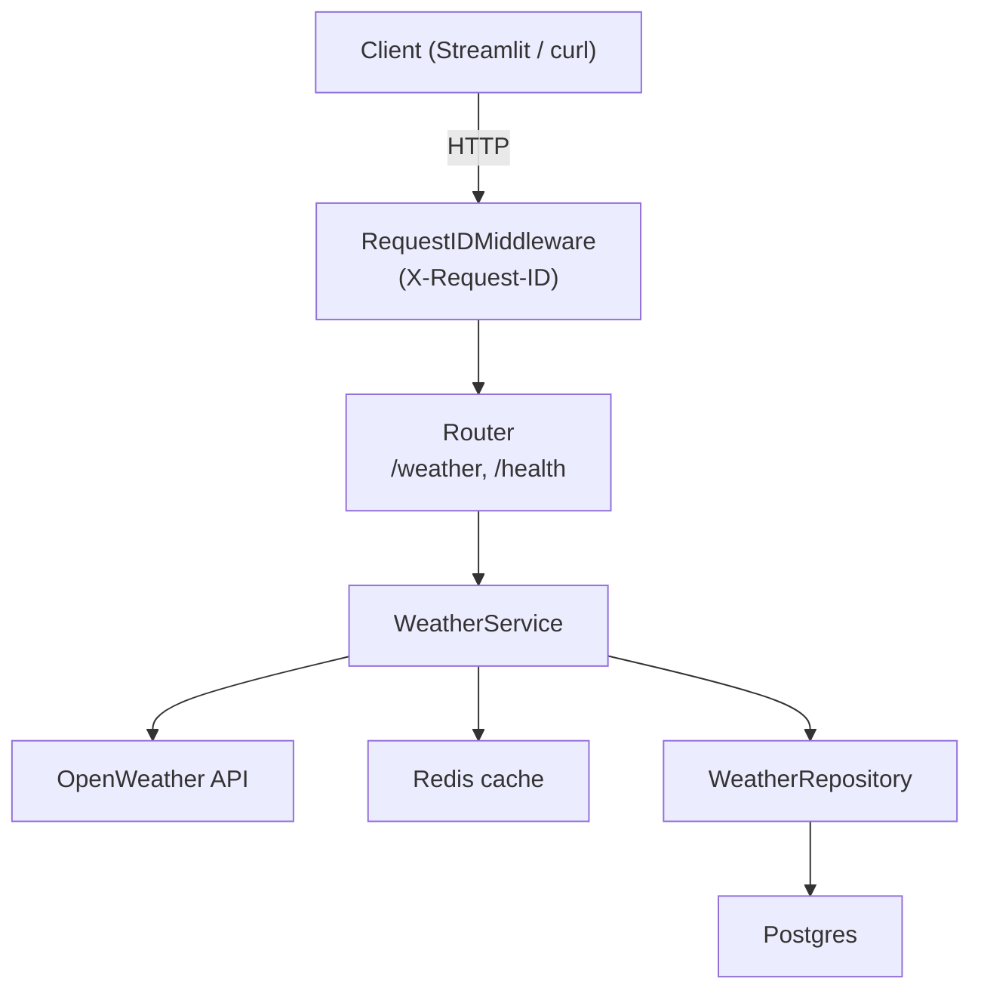

# Claude.md

Living document for Claude-assisted work on this project. Updated at the end of every phase.

## 1. Project purpose

Weather queries by city name, served via a FastAPI backend and a Streamlit frontend.
Results are persisted in Postgres and cached in Redis. Built TDD-first, incrementally.

## 2. Architecture overview

- **`app/core/config.py`** — Pydantic `Settings` loaded from environment variables.
- **`app/core/logging.py`** — JSON structured logging via stdlib; `setup_logging()` configures the root logger.
- **`app/main.py`** — FastAPI app instance with `RequestIDMiddleware` and the `/health` endpoint.
- **`app/routers/`** — one router per feature (e.g. `weather.py`). Registered on `app` at startup.
- **`app/schemas/`** — Pydantic request/response models.
- **`app/services/`** — business logic; orchestrates external clients, cache, repositories.
- **`app/repositories/`** — database access via SQLAlchemy async.
- **`app/models/`** — SQLAlchemy ORM models.

## 3. Folder tree

```
weather-fast-api-agentic/
├── app/
│   ├── core/
│   │   ├── config.py        # Pydantic Settings
│   │   └── logging.py       # JSON log setup
│   ├── models/              # ORM models (Phase 4)
│   ├── repositories/        # DB access (Phase 4)
│   ├── routers/             # API routers (Phase 3)
│   ├── schemas/             # Pydantic schemas (Phase 3)
│   ├── services/            # Business logic (Phase 3)
│   └── main.py              # FastAPI app + middleware
├── tests/
│   ├── conftest.py          # async_client fixture
│   ├── test_config.py
│   ├── test_health.py
│   ├── test_logging.py
│   ├── test_main.py
│   └── test_middleware.py
├── scripts/                 # one-off admin scripts
├── .claude/
│   ├── plan/build-roadmap.md
│   └── project.md
├── .env.example
├── .python-version          # 3.13
├── .vscode/settings.json    # Ruff format-on-save, Pyright strict
├── pyproject.toml
└── Claude.md
```

## 4. Data flow / request lifecycle

_TBD — populated in Phase 3._

## 5. TDD workflow

See `.claude/project.md` for the authoritative rules. Summary:
1. Derive tests from acceptance criteria.
2. Always use conftest.py to put common, shared reusable fixtures.
3. Propose tests; wait for review.
4. Implement minimal code.
5. User runs tests and pastes output.
6. Iterate to green; refactor after green.

## 6. Agent responsibilities

_TBD — populated in Phase 9._ See `.claude/project.md` for the spec of ClickUp / Tests / Implementor / Reviewer / Audit agents.

## 7. Commands the user should run

```bash
# Install / sync deps
uv sync

# Run all tests
uv run pytest

# Lint
uv run ruff check .

# Type check
uv run pyright

# Start API (dev)
uv run uvicorn app.main:app --reload
```

## 8. Conventions and constraints

- Python 3.13 (pinned via `.python-version`).
- `uv` for env and deps — never `pip` directly.
- Claude never runs `uv`, `docker`, `pytest`, migrations — proposes commands, user executes.
- Small diffs; no speculative code; no silent test edits.
- All async tests use the shared `async_client` fixture from `conftest.py` — no per-test client setup.
- Related assertions go in a single test function; only split when scenarios are genuinely independent.

## 9. Architecture diagram



_Cache and DB layers added in Phases 4–5._
